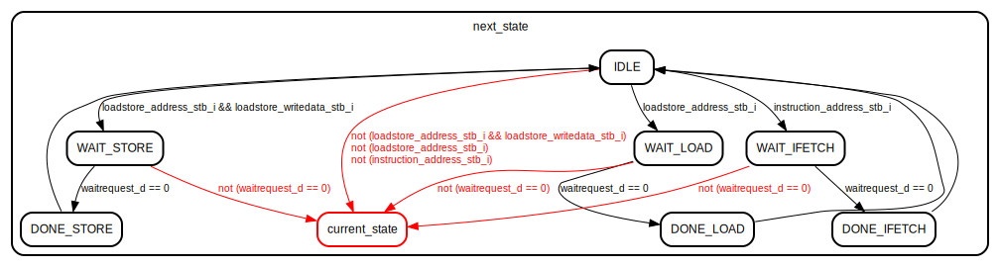

# Entity: mod_mem_ctrl 

- **File**: mod_mem_ctrl.sv
## Diagram

## Ports

| Port name                  | Direction | Type                    | Description |
| -------------------------- | --------- | ----------------------- | ----------- |
| clk_i                      | input     |                         | Global clock |
| rst_i                      | input     |                         | Global reset signal |
| instruction_address_i      | input     | [`XLEN-1:0]             | The word-aligned byte-address of the next instruction to be fetched. |
| instruction_address_stb_i  | input     |                         | HIGH if instruction_address_i is stable. This requests an instruction load. |
| instruction_readdata_o     | output    | [`XLEN-1:0]             | The word-aligned instruction, retrieved from the data located at instruction_address_i. |
| instruction_readdata_stb_o | output    |                         | HIGH if instruction_readdata_o is valid, hence an instruction load is complete. |
| loadstore_address_i        | input     | [`XLEN-1:0]             | The word-aligned byte-address of the next piece of data to load or store. |
| loadstore_address_stb_i    | input     |                         | HIGH if loadstore_address_i is stable. This requests a load/store operation. |
| loadstore_writedata_i      | input     | [`XLEN-1:0]             | The data to be written to loadstore_address_i in the case of a store operation. |
| loadstore_writedata_stb_i  | input     |                         | HIGH if loadstore_writedata_i is stable. When both this input and loadstore_address_stb_i are HIGH, this requests a store operation, instead of a load. |
| loadstore_readdata_o       | output    | [`XLEN-1:0]             | The data returned from a load operation. This output is valid when loadstore_stb_o is HIGH. |
| loadstore_stb_o            | output    |                         | HIGH when the load/store operation is complete. In the case of a load operation, then loadstore_readdata_o must contain the loaded data. |
| loadstore_byteenable_i     | input     | [`BYTEENABLE_WIDTH-1:0] | A bit field which represents the bytes that will be read-from or written-to. The MSB of this input represents the byte at (loadstore_address_i + 0), with the LSB representing the byte at (loadstore_address_i + `BYTEENABLE_WIDTH-1). |
| memory_byteenable_o        | output    | [`BYTEENABLE_WIDTH-1:0] | The Wishbone 4B compliant signal for |
| memory_waitrequest_i       | input     |                         | The Wishbone 4B compliant signal for |
| memory_readdata_i          | input     | [`XLEN-1:0]             | The Wishbone 4B compliant signal for |
| memory_writedata_o         | output    | [`XLEN-1:0]             | The Wishbone 4B compliant signal for |
| memory_address_o           | output    | [`XLEN-1:0]             | The Wishbone 4B compliant signal for |
| memory_write_o             | output    |                         | The Wishbone 4B compliant signal for |
| memory_read_o              | output    |                         | The Wishbone 4B compliant signal for |

## State machines

